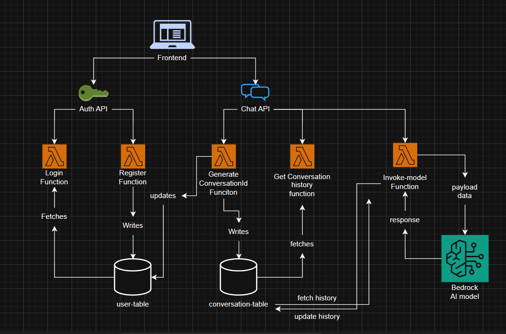

# 🚀 AI-Powered Chatbot – Serverless AWS Architecture


> A production-style, fully serverless AI chatbot built using AWS services and powered by Amazon Bedrock (Nova Micro model).
Supports authentication, multi-session conversations, persistent history, and contextual AI responses.
Designed following the Principle of Least Privilege (PoLP) with tightly scoped IAM roles and built in alignment with the AWS Well-Architected Framework to ensure security, reliability, performance efficiency, and cost optimization.

---

## 🌐 Live Demo

🔗 **URL:**
[Click Here ](chatbot-red-delta.vercel.app)

---
## 📚 Documentation

- [Click Here](./setup.md) to see how to setup the full project.
---

# 📌 Overview

This project demonstrates a **cloud-native AI chatbot system** built with:

* 🧠 Context-aware AI responses using Amazon Bedrock
* 🔐 Secure user authentication
* 💬 Multi-conversation chat sessions
* 💾 Persistent conversation history
* ⚡ Fully serverless backend
* 🌍 Modern Next.js frontend

The system is designed following **scalable serverless architecture principles** and **least-privilege IAM policies**.

---

# 🏗️ Architecture

## 🔁 Message Flow (End-to-End)

When a user sends a message:

1. **Next.js Frontend** sends request to API Gateway
2. **API Gateway** triggers a Lambda function
3. Lambda:

   * Retrieves conversation history from DynamoDB
   * Sends history + current message to Amazon Bedrock (Nova Micro)
   * Receives AI response
   * Updates DynamoDB with new conversation entries
4. Response is returned to frontend

---

## 📊 High-Level Architecture Diagram

<!-- ```
              ┌─────────────────────┐
              │    Next.js Frontend │
              └───────────┬─────────┘
                          │
                          ▼
                  ┌───────────────┐
                  │ API Gateway   │
                  └───────┬───────┘
                          │
                          ▼
                 ┌────────────────┐
                 │ AWS Lambda     │
                 │(Business Logic)│
                 └───────┬────────┘
          ┌──────────────┼──────────────┐
          ▼              ▼              ▼
  DynamoDB        Amazon Bedrock      Auth Logic
(user-table)       (Nova Micro)     (user-table)
(conversation-table)
``` -->

---

# 🧠 AI Layer

### 🔹 Model Used

* **Amazon Bedrock – Nova Micro**

### 🔹 Context Handling Strategy

Each model invocation includes:

* Previous conversation history
* Current user input
* Structured payload format

This enables:

* Context-aware replies
* Continuity across sessions
* Natural multi-turn conversation

---

# 🗄️ Database Design

## 🧾 `user-table`

| Attribute       | Purpose                    |
| --------------- | -------------------------- |
| userId (PK)     | Unique user identifier     |
| Credentials     | Login validation           |
| conversationIds | List of user conversations |

Used for:

* Authentication
* Tracking multiple chat sessions per user

---

## 💬 `conversation-table`

| Attribute           | Purpose                        |
| ------------------- | ------------------------------ |
| conversationId (PK) | Unique conversation identifier |
| Messages            | Full chat history (User + AI)  |

Used for:

* Fetching chat history
* Updating conversations
* Continuing previous sessions

---

# 🔐 Authentication System

### Lambda Functions:

* ✅ `register`
* ✅ `login`

Authentication flow:

1. User registers → stored in `user-table`
2. User logs in → validated against stored credentials
3. Session established on frontend

---

# 💬 Conversation Features

## ➕ Create New Chat

* Triggers `generate-conversation-id` Lambda
* Creates new entry in `conversation-table`
* Updates user’s conversation list in `user-table`

---

## 📂 View Conversation History

* Dedicated Lambda retrieves all conversation IDs
* Sidebar lists:

  * All previous chats
  * Full conversation history
* Users can resume any conversation seamlessly

---

## ✨ AI Message Processing

The `ModelInvokation` Lambda:

1. Fetches chat history
2. Sends structured payload to Bedrock
3. Receives AI response
4. Updates conversation history
5. Returns response to frontend

Ensures persistent, contextual dialogue.

---

# 🛠️ AWS Services Used

| Service            | Purpose                   |
| ------------------ | ------------------------- |
| Amazon API Gateway | REST API exposure         |
| AWS Lambda         | Serverless compute        |
| Amazon DynamoDB    | NoSQL data storage        |
| Amazon Bedrock     | AI model inference        |
| IAM                | Role-based access control |

---

# ⚡ Why This Architecture?

* ✅ Fully Serverless (No EC2)
* ✅ Auto-scalable
* ✅ Pay-per-use
* ✅ Decoupled components
* ✅ Secure with IAM least privilege
* ✅ Cloud-native design

---

# 🧪 API Structure (Backend)

### Conversation API

* `POST /modelinvoke`
* `POST /generateconvoid`
* `POST /gethistory`

### Auth API

* `POST /login`
* `POST /register`

---

# 📦 Tech Stack

**Frontend**

* Next.js
* Modern React Hooks
* Environment-based API config

**Backend**

* Python (AWS Lambda)
* Boto3 SDK
* Serverless Architecture

**Cloud**

* AWS
* Amazon Bedrock
* DynamoDB

---

# 🔮 Future Enhancements

* 🔐 JWT-based authentication
* 🧠 Conversation summarization
* ⚡ Streaming responses from Bedrock
* 📊 Token usage analytics
* 🛡️ Rate limiting
* 🚀 CI/CD pipeline

---

# 🏆 Key Learning Outcomes

* Designing production-style serverless architectures
* Managing AI inference pipelines
* Context handling in LLM applications
* DynamoDB schema planning
* IAM least-privilege policy design
* Full-stack cloud integration

---

# 👨‍💻 Author

**Sayantan Dey**
-- AWS Enthusiast | Cloud & AI Builder
